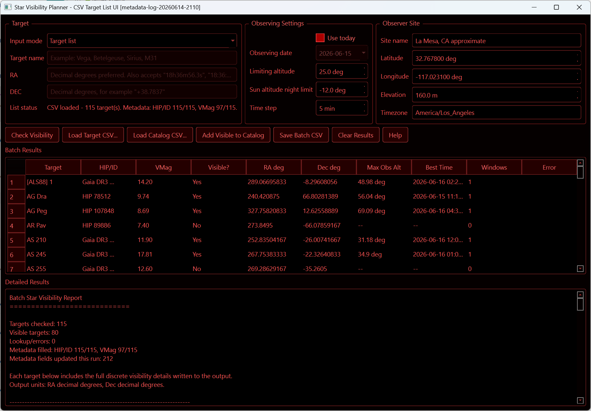

# Star Visibility Planner

Windows/Python tool for checking whether named stars or target-list entries are observable from a configured site. It can also append visible targets to a SharpCap-compatible custom catalog.

## Features

- Check visibility for one target or a CSV/TXT target list.
- Accept target lists with target names or RA/Dec coordinates.
- Resolve SIMBAD metadata for HIP/ID and V magnitude when available.
- Use fallback identifiers such as HD, Gaia DR3/DR2, TYC, BD, CD, CPD, and 2MASS when HIP is unavailable.
- Save batch visibility results to CSV.
- Append visible targets to a pipe-delimited SharpCap-compatible custom catalog.
- Includes a Help button in the application with workflow instructions.


## Run From Source

Python 3.13 was used for the current Windows build. Other recent Python 3 versions may work, but the standalone was validated from the `star_visibility` conda environment.

```powershell
python -m pip install -r requirements.txt
python star_visibility.py
```

## Target List Format

Use **Load Target CSV...** to select a CSV or TXT file.

Recommended columns:

```csv
target,ra,dec,label
```

- `target`: object name to look up in SIMBAD.
- `ra` and `dec`: decimal degrees. If both are present, coordinates are used directly.
- `label`: optional display name for coordinate-based rows.

## SharpCap Catalog Output

Custom catalogs are written using the exact SharpCap-compatible field order:

```text
IDs|Names|Type|RA(decimal hours)|Dec(degrees)|VMag|RMax(arcmin)|RMin(arcmin)|PosAngle
```

The HIP/alternate ID is written into the `IDs` field. The displayed target name is written into the `Names` field. V magnitude is written to two decimal places when available.

## Build Windows Standalone

Install build requirements in the environment you want bundled:

```powershell
python -m pip install -r requirements-build.txt
python -m PyInstaller --noconfirm --clean build\StarVisibilityPlanner_simbad.spec
```

Run the resulting app from:

```text
dist\StarVisibilityPlanner_simbad\StarVisibilityPlanner_simbad.exe
```

Do not copy the EXE by itself. The `_internal` folder beside it is required.

For GitHub, upload the zipped standalone folder as a **Release asset** instead of committing `dist/` or zip files to the repository.

## Notes

- SIMBAD lookups require internet access.
- If metadata lookup fails in the standalone build, the app writes `star_visibility_metadata_errors.log` beside the EXE.
- The default observing site is La Mesa, CA approximate; adjust the site fields in the UI as needed.

## License

This project is licensed under the BSD 3-Clause License. See `LICENSE`.
